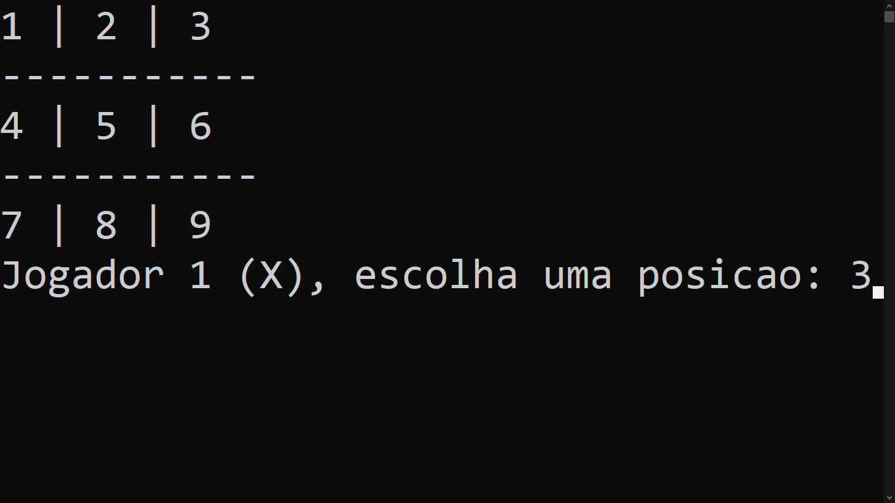

# 🕹 Jogo da velha

Fiz esse jogo com o intuito de promover a brincadeira através da programação, ele foi estritamente feito na linguagem c++, possibilitando você jogar no seu próprio aparelho, aproveite!


## 🖼 Demonstração



## ⚙ Instalação e Pré-requisitos

Para compilar e executar este jogo da velha, será necessário um compilador C++.

### Pré-requisitos

- Sistema operacional: Windows, Linux ou MacOS;
- Compilador C++ instalado (por exemplo, [GCC](https://gcc.gnu.org/) ou [MinGW](http://www.mingw.org/));
- Terminal ou prompt de comando para executar o programa.

### Como compilar e executar

No terminal, navegue até a pasta do projeto e digite:

(```bash
g++ jogo_da_velha.cpp -o jogo
./jogo     | No Linux/macOS
jogo.exe   | No Windows)

## 👨‍🏫 Como Jogar? 

O tabuleiro começará com todas as posições vazias, representadas por números de 1 a 9. O jogador inicial (marcado pelas posições X) escolherá uma posição, se algo diferente de 1, 2, 3, 4, 5, 6, 7, 8, 9, for escrito no terminal, você escolhe novamente até escrever alguma posição que não está preenchida no tabuleiro, o mesmo para o segundo jogador (marcado pelas posições O).

Ganha o jogo o primeiro jogador a fazer três símbolos iguais em sequência, tanto verticalmente, horizontalmente ou diagonalmente. Se ao final do preenchimento das 9 posições não existir um vencedor, o jogo termina em empate.

Ao final de cada partida, o programa perguntará se quer começar ou não outra partida da posição inicial, digite 'S' ou 's' para "sim", ou 'N' ou 'n' para "não".

## 👨‍💻 Estrutura do projeto

Jogo-da-velha/
├── assets/
|    ├── Projeto_funcionando.png
|    └── Logo_Mit_License.png
├── .gitignore
├── LICENSE
├── README.md
└── main.cpp

### Principais Arquivos

README.md - Explicação do projeto, guia pessoas que irão analisar código;

LICENSE - Licença MIT utilizada no projeto;

main.cpp - Código principal para funcionamento do jogo da velha;

.gitignore - Ignora arquivos que não serão usados em c++;

assets/ - Diretório para guardar as imagens do repositório.

## Licença  

Este projeto está licenciado sob a MIT License - veja o arquivo [LICENSE](LICENSE) para mais detalhes.  

